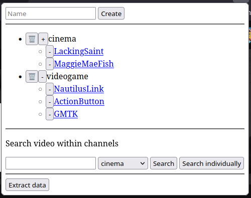

# youtube-tag
Extension to tag channels in YouTube

## Version 1:
Works as an alternative list of subscriptions, where you can more easily find channels by topic
### Features
- Add tag to channel (when in channel page in YouTube)
- Search for video within the channels of a tag

### Install

  <a href="./youtube-tag.xip">
    Firefox
  </a>

